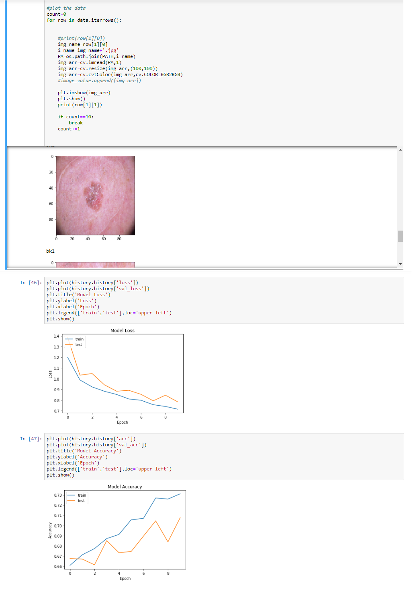

# Abdulkareem Almansoori

## Skin Model Checker
Checks the skin's model accuracy and/or loss from the picture of the skin. This can be useful for determing whether the patient has skin cancer too.

### Results:

